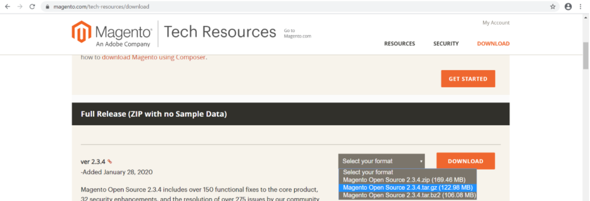
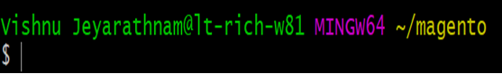

Pre-instructions

- Git clone this repo from GitHub to your localhost https://github.com/LEGreen1984/magento-environment.git

- Go to the magento download site and download the open source version as a TAR file

- Next, create a directory called ‘magento’ with the path ‘~/magento’.

- Copy and paste the tar file into this folder. This is vital because the ‘synced folder’ route is hardcoded.

Download and install: Vagrant & VirtualBox :

- <vagrant up> To create your VM

- <vagrant ssh> Will give you access to a shell

Creating Magento Database

By now, all the packages required to support Magento 2 installation are ready. Next, we’ll create a blank database for Magento. To accomplish this, first, login to the MYSQL server:

1.	$ sudo mysql -u root -p

You will be prompted for your MYSQL Server password. Enter the password and click Enter to continue.

Run the following commands to create a new database titled Magento:

2.	CREATE DATABASE  magento;

Next, create a user called magentouser and assign the user a new password, using the commands below:

3.	CREATE USER'magentouser'@'localhost'IDENTIFIED BY'EnterNewPasswordHere';

Then grant, the user you’ve created unlimited access to the new database:

4.	GRANT ALL ON magento.* TO'magentouser'@'localhost'IDENTIFIED BY'EnterPasswordHere'WITH GRANT OPTION;

Save the changes and exit:

5.	FLUSH PRIVILEGES;

6.	EXIT;
